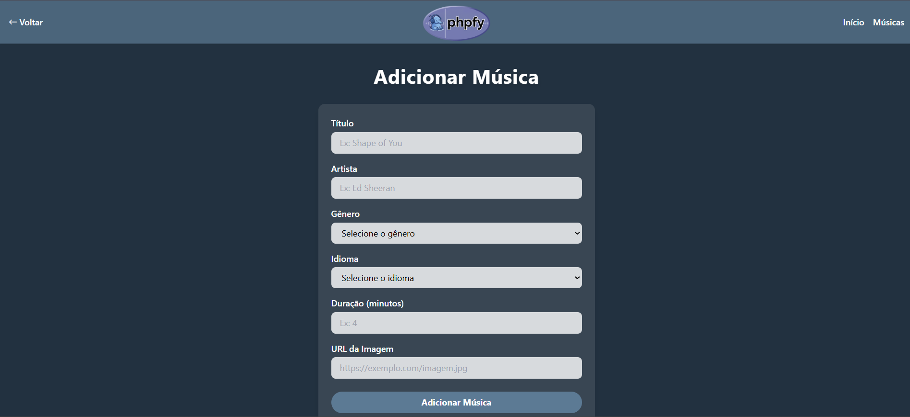
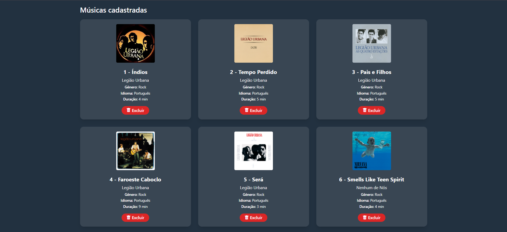
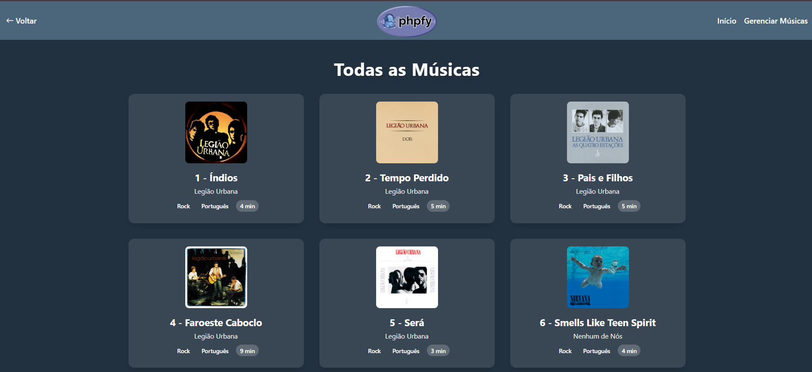

# 🎵 PHPFY 

  

PHPFY é uma aplicação web simples inspirada no Spotify, desenvolvida em PHP, que permite o cadastro e exibição de músicas utilizando banco de dados MySQL e organização em camadas (MVC).

---

## 🏠 Home

> Página inicial .

---

## 📝 Formulário

> Página de cadastro com validações, onde o usuário pode inserir músicas com título, artista, gênero, idioma, duração e imagem e com a listagem de músicas cadastradas com a opção de excluir.

---

## 🃏 Cards

> Página extra com a exibição visual das músicas em formato de cards.

---

## 📚 Requisitos atendidos

- [x] Script SQL incluído
- [x] Formulário com 5 campos (2 selects)
- [x] Listagem, inserção e exclusão
- [x] Validação obrigatória de campos
- [x] Validações extras implementadas
- [x] Estilização com CSS
- [x] Página extra com cards
- [x] Uso de orientação a objetos

---

## 👨‍🏫 Projeto para disciplina de LPW

**Curso Técnico em Desenvolvimento de Sistemas**  
**Instituto Federal do Paraná – Campus Foz do Iguaçu**  
**Professor: Daniel Di Domenico**  
**Entrega: 27/06/2025**

---

Desenvolvido com 💚 para o projeto de **Linguagem de Programação para Web**
